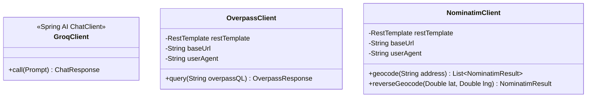
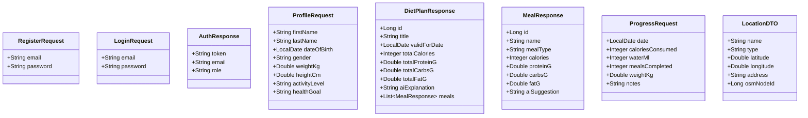

# NutriCook — Class Diagram (Software Architecture)

**Version**: 1.0.0 | **Date**: 2026-04-26

> This diagram covers the Spring Boot application layer —
> Controllers, Services, Repositories, and DTOs.
> For JPA entities and DB relationships see `data-model.md`.

---

## Layer Overview

```
┌─────────────────────────────────────────┐
│  Frontend (React + Vite)                │
│  Axios HTTP client with JWT interceptor │
└──────────────┬──────────────────────────┘
               │ REST / JSON
┌──────────────▼──────────────────────────┐
│  Controller Layer  (@RestController)    │
│  AuthController  DietController         │
│  ProfileController  ProgressController  │
│  LocationController  AchievementController │
└──────────────┬──────────────────────────┘
               │
┌──────────────▼──────────────────────────┐
│  Service Layer  (@Service)              │
│  AuthService  DietPlanService           │
│  UserProfileService  NutritionService   │
│  ProgressService  AchievementService    │
│  LocationService  GroqAiService         │
└──────────┬────────────────┬────────────┘
           │                │
┌──────────▼──────┐  ┌──────▼──────────────┐
│  Repository     │  │  External Clients   │
│  Layer          │  │  GroqClient         │
│  (Spring Data   │  │  NominatimClient    │
│   JPA)          │  │  OverpassClient     │
└──────────┬──────┘  └─────────────────────┘
           │
┌──────────▼──────────────────────────────┐
│  Database  (H2 / Supabase PostgreSQL)   │
└─────────────────────────────────────────┘
```

---

## Controller Layer

```mermaid
classDiagram
    class AuthController {
        -AuthService authService
        +register(RegisterRequest) ResponseEntity~AuthResponse~
        +login(LoginRequest) ResponseEntity~AuthResponse~
    }

    class ProfileController {
        -UserProfileService profileService
        +getProfile(Long userId) ResponseEntity~ProfileResponse~
        +updateProfile(Long userId, ProfileRequest) ResponseEntity~ProfileResponse~
        +addHealthCondition(Long userId, Long conditionId) ResponseEntity~Void~
        +removeHealthCondition(Long userId, Long conditionId) ResponseEntity~Void~
        +addDietaryRestriction(Long userId, Long restrictionId) ResponseEntity~Void~
        +removeDietaryRestriction(Long userId, Long restrictionId) ResponseEntity~Void~
    }

    class DietController {
        -DietPlanService dietPlanService
        +generatePlan(Long userId, LocalDate date) ResponseEntity~DietPlanResponse~
        +getPlan(Long planId) ResponseEntity~DietPlanResponse~
        +listPlans(Long userId) ResponseEntity~List~DietPlanResponse~~
        +archivePlan(Long planId) ResponseEntity~Void~
    }

    class ProgressController {
        -ProgressService progressService
        +logProgress(Long userId, ProgressRequest) ResponseEntity~ProgressResponse~
        +getWeeklyProgress(Long userId, LocalDate weekStart) ResponseEntity~List~ProgressResponse~~
    }

    class AchievementController {
        -AchievementService achievementService
        +getUserAchievements(Long userId) ResponseEntity~List~AchievementResponse~~
        +getAllAchievements() ResponseEntity~List~AchievementResponse~~
    }

    class LocationController {
        -LocationService locationService
        +getNearbyRestaurants(Double lat, Double lng, List~String~ restrictions) ResponseEntity~LocationResponse~
        +getNearbyStores(Double lat, Double lng) ResponseEntity~LocationResponse~
    }
```



---

## Service Layer

```mermaid
classDiagram
    class AuthService {
        -UserRepository userRepository
        -PasswordEncoder passwordEncoder
        -JwtService jwtService
        +register(RegisterRequest) AuthResponse
        +login(LoginRequest) AuthResponse
        -buildJwt(User) String
    }

    class JwtService {
        -String secretKey
        -long expirationMs
        +generateToken(User) String
        +extractEmail(String token) String
        +isTokenValid(String token, UserDetails) boolean
        +extractExpiration(String token) Date
    }

    class UserProfileService {
        -UserProfileRepository profileRepository
        -HealthConditionRepository conditionRepository
        -DietaryRestrictionRepository restrictionRepository
        +getProfile(Long userId) UserProfile
        +updateProfile(Long userId, ProfileRequest) UserProfile
        +addHealthCondition(Long userId, Long conditionId) void
        +addDietaryRestriction(Long userId, Long restrictionId) void
    }

    class DietPlanService {
        -DietPlanRepository planRepository
        -FoodItemRepository foodRepository
        -UserProfileService profileService
        -NutritionService nutritionService
        -GroqAiService groqService
        +generatePlan(Long userId, LocalDate date) DietPlan
        +archivePlan(Long planId) void
        +listPlans(Long userId) List~DietPlan~
        -selectCompatibleFoods(UserProfile) List~FoodItem~
        -buildMeals(List~FoodItem~, int targetCalories) List~Meal~
        -computeTDEE(UserProfile) int
    }

    class NutritionService {
        +computeTotals(List~Meal~) NutritionTotals
        +validateAgainstConditions(List~Meal~, List~HealthCondition~) List~Meal~
        -computeAtwater(FoodItem, double quantityG) MacroBreakdown
    }

    class GroqAiService {
        -ChatClient chatClient
        -String modelName
        +getMealSuggestion(Meal, UserProfile) String
        +getPlanExplanation(DietPlan, UserProfile) String
        -loadPrompt(String templateName) String
    }

    class ProgressService {
        -ProgressRepository progressRepository
        -AchievementService achievementService
        +logProgress(Long userId, ProgressRequest) ProgressEntry
        +getWeeklyProgress(Long userId, LocalDate weekStart) List~ProgressEntry~
    }

    class AchievementService {
        -UserAchievementRepository userAchievementRepository
        -AchievementRepository achievementRepository
        -ProgressRepository progressRepository
        +checkAndAward(Long userId) List~UserAchievement~
        -evaluateStreak(Long userId) int
        -evaluateGoalCount(Long userId, AchievementType) int
    }

    class LocationService {
        -OverpassClient overpassClient
        -NominatimClient nominatimClient
        -CacheManager cacheManager
        +getNearbyRestaurants(Double lat, Double lng, List~String~ restrictions) List~LocationDTO~
        +getNearbyStores(Double lat, Double lng) List~LocationDTO~
        -buildOverpassQuery(Double lat, Double lng, String amenity) String
    }
```



---

## Repository Layer

```mermaid
classDiagram
    class UserRepository {
        +findByEmail(String email) Optional~User~
        +existsByEmail(String email) boolean
    }

    class UserProfileRepository {
        +findByUserId(Long userId) Optional~UserProfile~
    }

    class DietPlanRepository {
        +findByUserIdAndStatus(Long userId, PlanStatus) List~DietPlan~
        +findByUserIdAndValidForDateAndStatus(Long, LocalDate, PlanStatus) Optional~DietPlan~
        +findAllByUserId(Long userId) List~DietPlan~
    }

    class FoodItemRepository {
        +findByCategory(String category) List~FoodItem~
        +findCompatibleFoods(List~Long~ excludedRestrictionIds) List~FoodItem~
    }

    class ProgressRepository {
        +findByUserIdAndDate(Long userId, LocalDate) Optional~ProgressEntry~
        +findByUserIdAndDateBetween(Long, LocalDate, LocalDate) List~ProgressEntry~
    }

    class AchievementRepository {
        +findByType(AchievementType) List~Achievement~
    }

    class UserAchievementRepository {
        +findByUserId(Long userId) List~UserAchievement~
        +existsByUserIdAndAchievementId(Long, Long) boolean
    }

    class HealthConditionRepository {
        +findAll() List~HealthCondition~
    }

    class DietaryRestrictionRepository {
        +findAll() List~DietaryRestriction~
    }
```



---

## External API Clients



---

## Key DTOs (Request / Response)



---

## Security Filter Chain

```mermaid
classDiagram
    class SecurityConfig {
        -JwtAuthFilter jwtAuthFilter
        +securityFilterChain(HttpSecurity) SecurityFilterChain
        +passwordEncoder() PasswordEncoder
        +authenticationManager() AuthenticationManager
    }

    class JwtAuthFilter {
        -JwtService jwtService
        -UserDetailsService userDetailsService
        +doFilterInternal(request, response, chain) void
    }

    SecurityConfig --> JwtAuthFilter : registers
    JwtAuthFilter --> JwtService : validates token
