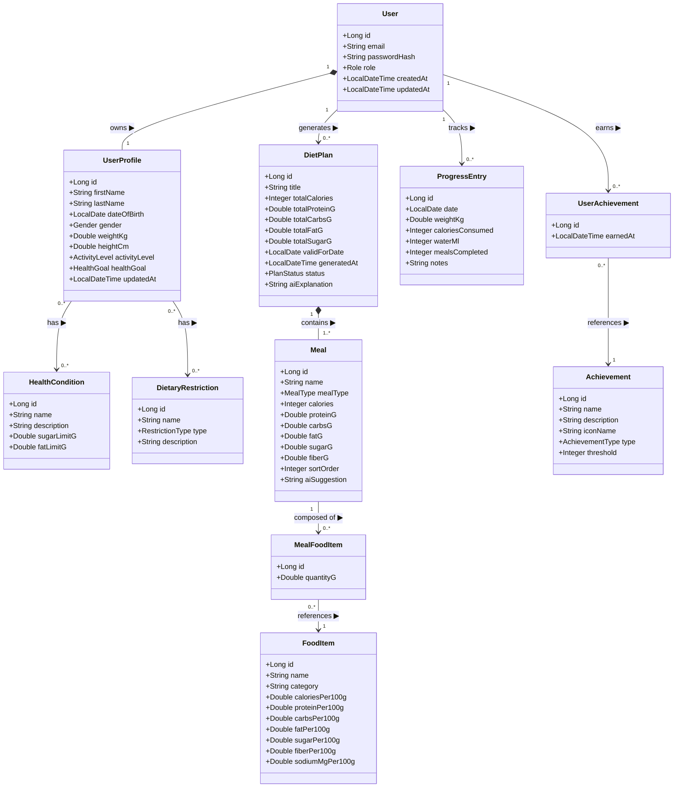
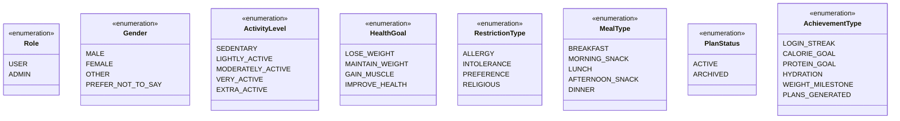

# NutriCook — UML Data Model

**Version**: 1.0.0 | **Date**: 2026-04-26 | **Status**: Approved

> **Constitution rule (Principle V):** This diagram MUST be updated before any
> JPA entity is created or modified. No entity class may be merged without a
> corresponding update here.

---

## 1. Entity Overview

| Entity | Type | Purpose |
|---|---|---|
| `User` | Core | Authentication identity (email + BCrypt password) |
| `UserProfile` | Core | Health & diet profile linked 1-to-1 to User |
| `HealthCondition` | Lookup | Conditions a user can have (Diabetes, Hypertension…) |
| `DietaryRestriction` | Lookup | Food restrictions/preferences (Vegan, Gluten-Free…) |
| `DietPlan` | Core | AI-generated daily meal plan for a user |
| `Meal` | Core | Individual meal within a DietPlan |
| `FoodItem` | Reference | Food database entry with per-100g nutrition values |
| `MealFoodItem` | Junction | Links a Meal to a FoodItem with serving quantity |
| `ProgressEntry` | Tracking | One daily health-tracking record per user per day |
| `Achievement` | Lookup | Achievement definitions (streak, goals…) |
| `UserAchievement` | Junction | Links a User to an Achievement they have earned |

---

## 2. Main Class Diagram

---

## 3. Enum Definitions

### Enum-to-Entity mapping

| Enum | Used in entity | Field |
|---|---|---|
| `Role` | `User` | `role` |
| `Gender` | `UserProfile` | `gender` |
| `ActivityLevel` | `UserProfile` | `activityLevel` |
| `HealthGoal` | `UserProfile` | `healthGoal` |
| `RestrictionType` | `DietaryRestriction` | `type` |
| `MealType` | `Meal` | `mealType` |
| `PlanStatus` | `DietPlan` | `status` |
| `AchievementType` | `Achievement` | `type` |

---

## 4. Relationship Details

| Relationship | Type | Cardinality | JPA mapping | Notes |
|---|---|---|---|---|
| User → UserProfile | Composition | 1 : 1 | `@OneToOne(cascade=ALL, orphanRemoval=true)` | Deleting User cascades to Profile |
| User → DietPlan | Association | 1 : 0..* | `@OneToMany(mappedBy="user")` | Plan archived, never deleted |
| User → ProgressEntry | Association | 1 : 0..* | `@OneToMany(mappedBy="user")` | Unique constraint on (user_id, date) |
| User → UserAchievement | Association | 1 : 0..* | `@OneToMany(mappedBy="user")` | |
| UserProfile ↔ HealthCondition | M:N Association | 0..* : 0..* | `@ManyToMany` — junction table `user_health_conditions` | Lookup seeded at startup |
| UserProfile ↔ DietaryRestriction | M:N Association | 0..* : 0..* | `@ManyToMany` — junction table `user_dietary_restrictions` | Lookup seeded at startup |
| DietPlan → Meal | Composition | 1 : 1..* | `@OneToMany(cascade=ALL, orphanRemoval=true)` | At least 1 meal required |
| Meal → MealFoodItem | Association | 1 : 0..* | `@OneToMany(cascade=ALL, orphanRemoval=true)` | |
| MealFoodItem → FoodItem | Association | 0..* : 1 | `@ManyToOne` | FoodItem is reference data, never deleted |
| UserAchievement → Achievement | Association | 0..* : 1 | `@ManyToOne` | Achievement is reference data |

---

## 5. Business Rules & Constraints

### User
- `email` MUST be unique across the table.
- `passwordHash` MUST be BCrypt-encoded (strength ≥ 10). Never store plaintext.
- Default `role` = `USER`; `ADMIN` is assigned manually.

### UserProfile
- `dateOfBirth` is used to derive age dynamically — do not store `age` directly.
- `weightKg` range: 20.0 – 500.0 kg (validated at service layer).
- `heightCm` range: 50.0 – 300.0 cm (validated at service layer).
- A `UserProfile` MUST be created atomically with its `User` during registration.

### HealthCondition (lookup)
- `sugarLimitG`: max grams of sugar per meal for users with this condition.
  - Diabetes → 15g
  - (null) → no limit
- `fatLimitG`: max grams of fat per meal for users with this condition.
  - High Cholesterol → 25g
  - (null) → no limit
- Seeded at application startup; not user-editable.

### DietaryRestriction (lookup)
- Seeded at application startup with: Vegan, Vegetarian, Gluten-Free, Lactose-Free, Nut Allergy.
- Not user-editable (users only select from the predefined list).

### DietPlan
- Only one `DietPlan` per user per `validForDate` can have `status = ACTIVE`.
  Enforced via unique constraint on `(user_id, valid_for_date, status)` —
  or by archiving the old active plan before inserting a new one.
- `totalCalories`, `totalProteinG`, `totalCarbsG`, `totalFatG`, `totalSugarG`
  MUST equal the sum of their respective `Meal` fields (enforced at service layer).

### Meal
- At least 1 `Meal` per `DietPlan` (enforced by `@OneToMany(cascade=ALL)` with a
  `@Size(min=1)` validation on the collection).
- `sortOrder` determines display order: 1=Breakfast, 2=Morning Snack, etc.

### ProgressEntry
- Unique constraint on `(user_id, date)` — one entry per user per calendar day.
- `caloriesConsumed`, `waterMl`, `mealsCompleted` MUST be ≥ 0.
- `weightKg` is nullable (user may not weigh themselves every day).

### FoodItem
- `name` MUST be unique.
- All `*Per100g` fields MUST be ≥ 0.
- `caloriesPer100g` is derived from macros using Atwater factors
  (protein × 4 + carbs × 4 + fat × 9) — validated at import time, not enforced in DB.

### MealFoodItem
- `quantityG` MUST be > 0.

### Achievement (lookup)
- Seeded at startup; not user-editable.
- `threshold` meaning depends on `type`:
  - `LOGIN_STREAK` → consecutive days
  - `CALORIE_GOAL` → number of days goal hit
  - `PLANS_GENERATED` → number of plans created

---

## 6. Database Table Conventions

| Convention | Value |
|---|---|
| Table naming | `snake_case`, plural (e.g., `diet_plans`, `food_items`) |
| Column naming | `snake_case` (e.g., `valid_for_date`, `calories_per_100g`) |
| Primary keys | `BIGSERIAL` (auto-increment) named `id` |
| Foreign keys | `{referenced_table_singular}_id` (e.g., `user_id`, `diet_plan_id`) |
| Junction tables | `{table_a}_{table_b}` alphabetical (e.g., `user_dietary_restrictions`) |
| Timestamps | `TIMESTAMP WITH TIME ZONE`, column names `created_at` / `updated_at` |
| Soft delete | Not used — `status` enum on `DietPlan` (ACTIVE/ARCHIVED) handles lifecycle |
| Indexes | All FK columns indexed; `(user_id, date)` on `progress_entries` (unique); `email` on `users` (unique) |

---

## 7. Recommended Seed Data

These lookup tables MUST be populated via a Spring Boot `DataInitializer`
component on first startup if empty.

**HealthCondition seed:**

| name | sugarLimitG | fatLimitG |
|---|---|---|
| Diabetes | 15 | null |
| High Cholesterol | null | 25 |
| Hypertension | null | null |
| Celiac Disease | null | null |
| Lactose Intolerance | null | null |

**DietaryRestriction seed:**

| name | type |
|---|---|
| Vegan | PREFERENCE |
| Vegetarian | PREFERENCE |
| Gluten-Free | INTOLERANCE |
| Lactose-Free | INTOLERANCE |
| Nut Allergy | ALLERGY |
| Halal | RELIGIOUS |
| Kosher | RELIGIOUS |

**Achievement seed (examples):**

| name | type | threshold | iconName |
|---|---|---|---|
| First Steps | PLANS_GENERATED | 1 | seedling |
| Week Warrior | LOGIN_STREAK | 7 | fire |
| Protein Champion | PROTEIN_GOAL | 5 | dumbbell |
| Hydration Hero | HYDRATION | 7 | droplet |
| Transformation | WEIGHT_MILESTONE | 1 | star |
