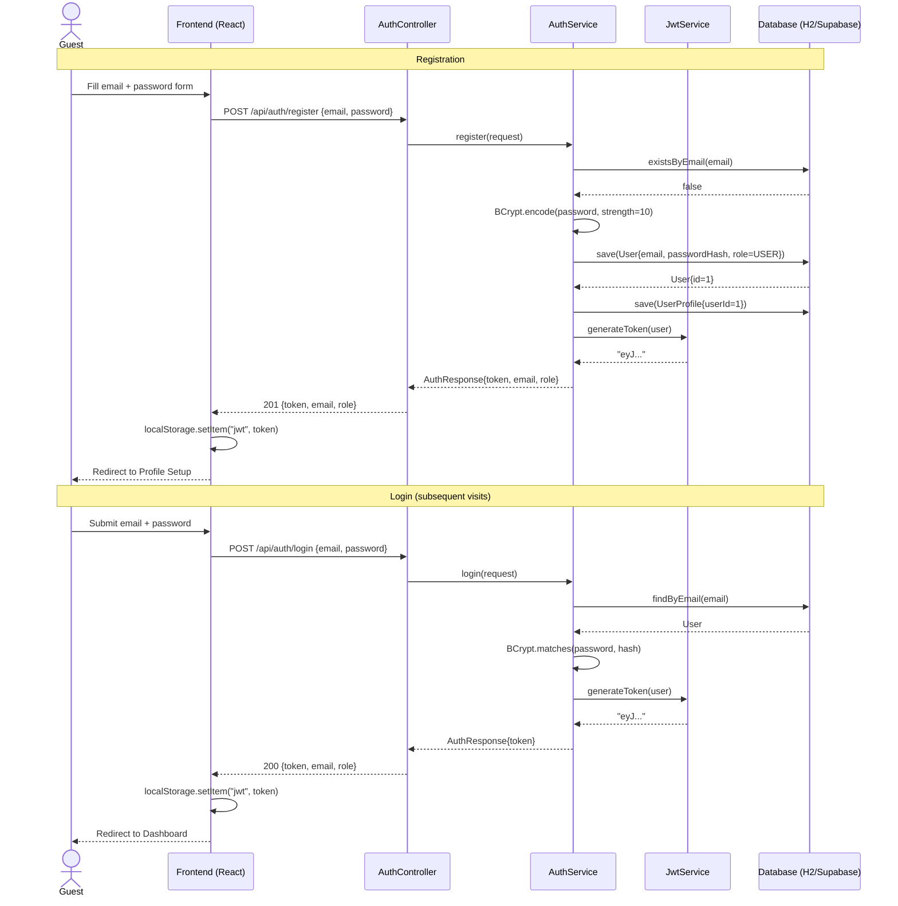
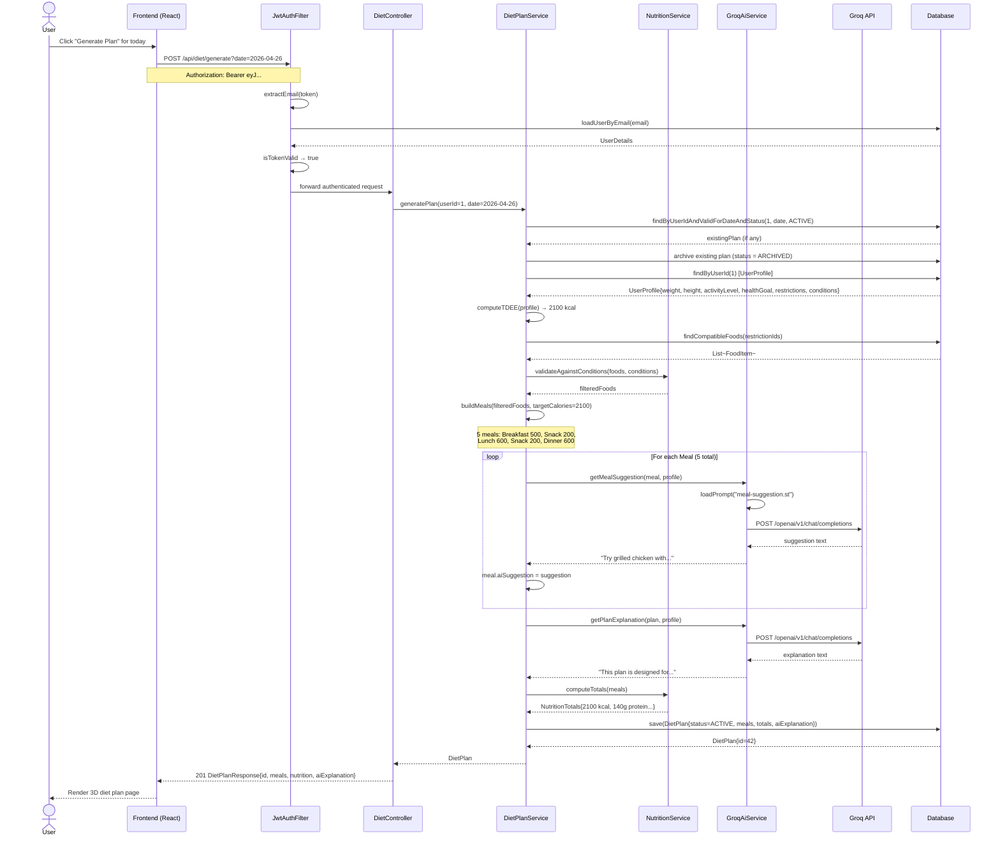
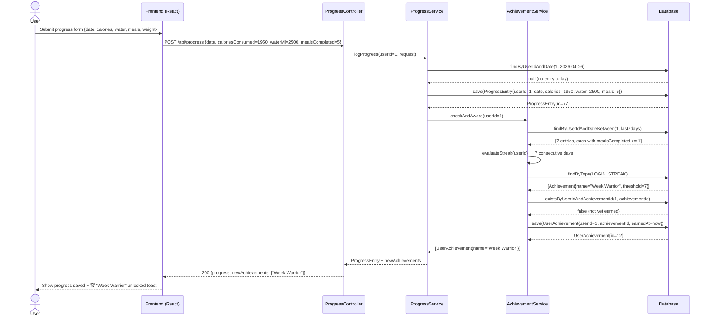

# NutriCook — Sequence Diagrams

**Version**: 1.0.0 | **Date**: 2026-04-26

---

## SD-01 — User Registration & Login (JWT Flow)



---

## SD-02 — Generate Diet Plan (Core Flow)



---

## SD-03 — Find Nearby Restaurants (OSM Flow)

```mermaid
sequenceDiagram
    actor User
    participant FE as Frontend (React + Leaflet)
    participant LC as LocationController
    participant LS as LocationService
    participant Cache as Caffeine Cache
    participant OV as OverpassClient
    participant OSM as Overpass API (OSM)

    User->>FE: Click "Nearby Restaurants"
    FE->>FE: navigator.geolocation.getCurrentPosition()
    FE->>FE: lat=36.8606, lng=10.2087

    FE->>LC: GET /api/location/restaurants?lat=36.86&lng=10.21&restrictions=vegan
    LC->>LS: getNearbyRestaurants(36.86, 10.21, ["vegan"])

    LS->>Cache: get("restaurants:36.86:10.21:vegan")
    Cache-->>LS: null (cache miss)

    LS->>LS: buildOverpassQuery(lat, lng, "restaurant")
    Note over LS: [out:json]; node["amenity"="restaurant"]<br/>(around:2000, 36.86, 10.21); out body;

    LS->>OV: query(overpassQL)
    Note over OV: User-Agent: NutriCook / anasbougrine63@gmail.com
    OV->>OSM: POST https://overpass-api.de/api/interpreter
    OSM-->>OV: {elements: [{id, lat, lon, tags}...]}
    OV-->>LS: OverpassResponse

    LS->>LS: map to List~LocationDTO~
    LS->>LS: filter by restrictions (tag matching)
    LS->>Cache: put("restaurants:36.86:10.21:vegan", results, TTL=1h)

    LS-->>LC: List~LocationDTO~
    LC-->>FE: 200 [{name, lat, lng, address, osmNodeId}...]

    FE->>FE: Render markers on Leaflet map
    FE-->>User: Interactive map with restaurant pins
```

---

## SD-04 — Daily Progress Log + Achievement Unlock


