# NutriCook — Use Case Diagram

**Version**: 1.0.0 | **Date**: 2026-04-26

---

## Actors

| Actor | Description |
|---|---|
| **Guest** | Unauthenticated visitor — can only register or log in |
| **User** | Authenticated NutriCook user with a complete profile |
| **Groq AI** | External AI service — invoked by the system to generate meal content |
| **OSM APIs** | External OpenStreetMap services (Nominatim + Overpass) — invoked for location features |

---

## Use Case Diagram

```mermaid
graph TD
    subgraph System["NutriCook System"]

        subgraph Auth["Authentication"]
            UC1[Register]
            UC2[Login]
            UC3[Logout]
        end

        subgraph Profile["Profile Management"]
            UC4[Create / Update Profile]
            UC5[Set Health Conditions]
            UC6[Set Dietary Restrictions]
        end

        subgraph Diet["Diet Planning"]
            UC7[Generate Diet Plan]
            UC8[View Diet Plan]
            UC9[Archive Diet Plan]
            UC10[View Meal Details]
        end

        subgraph AI["AI Features"]
            UC11[Get AI Meal Suggestion]
            UC12[Get AI Plan Explanation]
        end

        subgraph Nutrition["Nutrition"]
            UC13[View Nutrition Breakdown]
            UC14[View Food Item Details]
        end

        subgraph Progress["Progress & Achievements"]
            UC15[Log Daily Progress]
            UC16[View Weekly Progress]
            UC17[View Achievements]
        end

        subgraph Location["Location"]
            UC18[Find Nearby Restaurants]
            UC19[Find Nearby Grocery Stores]
            UC20[View Location on Map]
        end

    end

    Guest --> UC1
    Guest --> UC2

    User --> UC2
    User --> UC3
    User --> UC4
    User --> UC5
    User --> UC6
    User --> UC7
    User --> UC8
    User --> UC9
    User --> UC10
    User --> UC13
    User --> UC14
    User --> UC15
    User --> UC16
    User --> UC17
    User --> UC18
    User --> UC19
    User --> UC20

    UC7 -.->|includes| UC11
    UC7 -.->|includes| UC12
    UC7 -.->|includes| UC13

    UC11 -.->|uses| GroqAI([Groq AI])
    UC12 -.->|uses| GroqAI

    UC18 -.->|uses| OSM([OSM Overpass API])
    UC19 -.->|uses| OSM
    UC20 -.->|uses| OSM2([OSM Nominatim API])
```

---

## Use Case Specifications

### UC1 — Register

| Field | Detail |
|---|---|
| **Actor** | Guest |
| **Precondition** | User is not authenticated |
| **Main Flow** | 1. Guest submits email + password → 2. System validates email uniqueness → 3. System BCrypt-hashes password → 4. User record created → 5. Empty UserProfile created → 6. JWT returned |
| **Alternative Flow** | Email already taken → 400 with field error |
| **Postcondition** | User is authenticated; empty profile awaits completion |

---

### UC2 — Login

| Field | Detail |
|---|---|
| **Actor** | Guest / User |
| **Precondition** | User has a registered account |
| **Main Flow** | 1. Submit email + password → 2. System loads User by email → 3. BCrypt verification → 4. JWT (24h) returned |
| **Alternative Flow** | Invalid credentials → 401 |
| **Postcondition** | JWT stored in frontend localStorage |

---

### UC4 — Create / Update Profile

| Field | Detail |
|---|---|
| **Actor** | User |
| **Precondition** | Authenticated |
| **Main Flow** | 1. Submit firstName, lastName, dateOfBirth, gender, weightKg, heightCm, activityLevel, healthGoal → 2. System validates ranges → 3. UserProfile saved |
| **Alternative Flow** | Invalid weight or height range → 422 |
| **Postcondition** | Profile complete; user can generate diet plans |

---

### UC7 — Generate Diet Plan *(core use case)*

| Field | Detail |
|---|---|
| **Actor** | User |
| **Precondition** | Profile complete (weight, height, activityLevel, healthGoal set) |
| **Main Flow** | 1. User requests plan for a date → 2. System checks no active plan exists for that date → 3. System computes TDEE from profile → 4. System selects compatible FoodItems respecting DietaryRestrictions and HealthCondition limits → 5. System builds Meals (5 per day: breakfast, 2 snacks, lunch, dinner) → 6. **includes** UC11 (AI suggestion per meal) → 7. **includes** UC12 (AI plan explanation) → 8. **includes** UC13 (nutrition totals) → 9. DietPlan saved with status=ACTIVE → 10. Previous active plan for same date archived |
| **Alternative Flow** | Groq API rate-limited → plan saved without AI text; user notified |
| **Postcondition** | Active DietPlan persisted; shown to user |

---

### UC11 — Get AI Meal Suggestion

| Field | Detail |
|---|---|
| **Actor** | System (included by UC7) |
| **Precondition** | Meal object constructed; user profile available |
| **Main Flow** | 1. System loads prompt template from `prompts/meal-suggestion.st` → 2. Interpolates meal + user data → 3. Calls Groq API (`llama-3.3-70b-versatile`) → 4. Response stored as `meal.aiSuggestion` |
| **Alternative Flow** | HTTP 429 → `aiSuggestion` set to null; no exception propagated |

---

### UC15 — Log Daily Progress

| Field | Detail |
|---|---|
| **Actor** | User |
| **Precondition** | Authenticated |
| **Main Flow** | 1. User submits date, caloriesConsumed, waterMl, mealsCompleted, optionally weightKg → 2. Upsert on (user_id, date) → 3. System checks achievement thresholds → 4. New achievements awarded if thresholds crossed |
| **Postcondition** | ProgressEntry saved; any new UserAchievement records created |

---

### UC18 — Find Nearby Restaurants

| Field | Detail |
|---|---|
| **Actor** | User |
| **Precondition** | Browser geolocation permission granted |
| **Main Flow** | 1. Frontend sends lat/lng + dietaryRestrictions → 2. Backend checks Caffeine cache (1h TTL) → cache miss: calls Overpass API for restaurant nodes within 2km → 3. Results filtered and enriched → 4. Returned as GeoJSON-compatible list → 5. Rendered on Leaflet map |
| **Alternative Flow** | Overpass API unreachable → cached result or empty list with user message |
